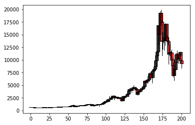

```python
import requests as req
import json
import pandas as pd
import datetime
from matplotlib.finance import candlestick2_ohlc
import matplotlib.pyplot as plt
```


```python
# Using CoinAPI

#url = 'https://rest.coinapi.io/v1/quotes/COINBASE_SPOT_BTC_USD/history?time_start=2016-01-01T00:00:00'
#header = {'X-CoinAPI-Key':'A0D75BBF-50C6-4DE5-A0D0-7A9EB34386D4'}
#resp = req.get(url,headers=header)
#data = resp.json()
```


```python
# Using CryptoCompare
base_url = 'https://min-api.cryptocompare.com/data/histoday?'

# Number of points to graph
num_points = 200

# Number of days to average together (so here it averages over three days)
aggregate = 3

# Crypto code
cc = 'BTC'
url = '%sfsym=%s&tsym=USD&limit=%s&aggregate=%s&e=CCCAGG'%(base_url,cc,str(num_points),str(aggregate))
resp = req.get(url)
data = resp.json()
```


```python
data['Data'][0]
```


    {'close': 670.38,
     'high': 680.94,
     'low': 655.72,
     'open': 664.2,
     'time': 1468627200,
     'volumefrom': 109802.37,
     'volumeto': 73983011.96}


```python
data_df = pd.DataFrame(columns=['Date','High','Low','Open','Close'])
for i in range(len(data['Data'])):
    date = datetime.datetime.fromtimestamp(int(data['Data'][i]['time'])).strftime('%Y-%m-%d')
    data_df.set_value(index=i,col='Date',value=date)
    data_df.set_value(index=i,col='High',value=data['Data'][i]['high'])
    data_df.set_value(index=i,col='Low',value=data['Data'][i]['low'])
    data_df.set_value(index=i,col='Open',value=data['Data'][i]['open'])
    data_df.set_value(index=i,col='Close',value=data['Data'][i]['close'])
data_df.head()
```


<div>
<style>
    .dataframe thead tr:only-child th {
        text-align: right;
    }

    .dataframe thead th {
        text-align: left;
    }

    .dataframe tbody tr th {
        vertical-align: top;
    }
</style>
<table border="1" class="dataframe">
  <thead>
    <tr style="text-align: right;">
      <th></th>
      <th>Date</th>
      <th>High</th>
      <th>Low</th>
      <th>Open</th>
      <th>Close</th>
    </tr>
  </thead>
  <tbody>
    <tr>
      <th>0</th>
      <td>2016-07-15</td>
      <td>680.94</td>
      <td>655.72</td>
      <td>664.2</td>
      <td>670.38</td>
    </tr>
    <tr>
      <th>1</th>
      <td>2016-07-18</td>
      <td>673.24</td>
      <td>657.82</td>
      <td>670.38</td>
      <td>664.62</td>
    </tr>
    <tr>
      <th>2</th>
      <td>2016-07-21</td>
      <td>669.44</td>
      <td>645.69</td>
      <td>664.62</td>
      <td>659.29</td>
    </tr>
    <tr>
      <th>3</th>
      <td>2016-07-24</td>
      <td>662.51</td>
      <td>643.49</td>
      <td>659.29</td>
      <td>654.54</td>
    </tr>
    <tr>
      <th>4</th>
      <td>2016-07-27</td>
      <td>657.96</td>
      <td>650.81</td>
      <td>654.54</td>
      <td>654.74</td>
    </tr>
  </tbody>
</table>
</div>


```python
fig, ax = plt.subplots()
candlestick2_ohlc(ax,data_df['Open'],data_df['High'],data_df['Low'],data_df['Close'])
plt.show()
```




